# Kuroibara Architecture Overview

This document provides comprehensive architecture diagrams showing the complete flow of the Kuroibara manga management system, broken down into specific architectural domains.

## Table of Contents

1. [Complete System Architecture](#complete-system-architecture)
2. [Frontend Architecture](#frontend-architecture)
3. [Backend Architecture](#backend-architecture)
4. [Search Architecture](#search-architecture)
5. [Download Architecture](#download-architecture)
6. [Components Architecture](#components-architecture)

---

## Complete System Architecture

```mermaid
graph TB
    %% User Layer
    User[👤 User] --> Browser[🌐 Web Browser]
    
    %% Frontend Layer
    Browser --> Frontend[🎨 Vue.js Frontend<br/>Port 3000]
    
    %% API Gateway
    Frontend --> API[🔌 FastAPI Backend<br/>Port 8000]
    
    %% Core Services Layer
    API --> Auth[🔐 Authentication Service]
    API --> Search[🔍 Enhanced Search Service]
    API --> Download[📥 Download Service]
    API --> Library[📚 Library Service]
    API --> Health[💚 Health Monitoring]
    
    %% Search Providers
    Search --> MU[📊 MangaUpdates API]
    Search --> MD[📖 MangaDex API]
    Search --> MDX[🌐 MadaraDex Parser]
    
    %% Download Clients
    Download --> QB[⚡ qBittorrent Client]
    Download --> SAB[📦 SABnzbd Client]
    Download --> Nyaa[🌸 Nyaa.si Indexer]
    
    %% Data Layer
    API --> DB[(🗄️ PostgreSQL Database)]
    API --> Cache[(⚡ Valkey Cache)]
    API --> Storage[💾 File Storage]
    
    %% External Services
    API --> Mail[📧 MailHog SMTP]
    
    %% Monitoring
    Health --> Providers[📡 Provider Health]
    Health --> Indexers[🔍 Indexer Health]
    Health --> Clients[📥 Client Health]
    
    %% Data Flow
    classDef userLayer fill:#e1f5fe
    classDef frontendLayer fill:#f3e5f5
    classDef backendLayer fill:#e8f5e8
    classDef dataLayer fill:#fff3e0
    classDef externalLayer fill:#fce4ec
    
    class User,Browser userLayer
    class Frontend frontendLayer
    class API,Auth,Search,Download,Library,Health backendLayer
    class DB,Cache,Storage dataLayer
    class MU,MD,MDX,QB,SAB,Nyaa,Mail,Providers,Indexers,Clients externalLayer
```

### System Flow Overview

1. **User Interaction**: Users interact through a modern Vue.js web interface
2. **API Communication**: Frontend communicates with FastAPI backend via REST APIs
3. **Service Layer**: Backend orchestrates multiple specialized services
4. **Data Management**: PostgreSQL for persistence, Valkey for caching
5. **External Integration**: Multiple manga providers, download clients, and indexers
6. **Health Monitoring**: Real-time monitoring of all system components

---

## Key Architectural Principles

- **Microservice-oriented**: Each major function is a separate service
- **API-first**: All functionality exposed through well-defined REST APIs
- **Tiered Search**: Intelligent fallback between multiple data sources
- **Health Monitoring**: Comprehensive monitoring of all external dependencies
- **Caching Strategy**: Multi-layer caching for optimal performance
- **Extensible Design**: Easy to add new providers, clients, and indexers

---

## Technology Stack

### Frontend
- **Framework**: Vue.js 3 with Composition API
- **Styling**: Tailwind CSS with dark mode support
- **State Management**: Pinia for reactive state
- **Routing**: Vue Router for SPA navigation
- **HTTP Client**: Axios for API communication

### Backend
- **Framework**: FastAPI with async/await support
- **Database**: PostgreSQL with SQLAlchemy ORM
- **Cache**: Valkey (Redis-compatible) for session and data caching
- **Authentication**: JWT tokens with bcrypt password hashing
- **Task Queue**: Background tasks for downloads and health checks

### Infrastructure
- **Containerization**: Docker with Docker Compose
- **Database Migrations**: Alembic for schema versioning
- **Development**: Hot reload for both frontend and backend
- **Monitoring**: Built-in health endpoints and dashboard

---

## Frontend Architecture

```mermaid
graph TB
    %% User Interface Layer
    Browser[🌐 Browser] --> App[📱 Vue.js App]

    %% Routing Layer
    App --> Router[🛣️ Vue Router]
    Router --> Auth[🔐 Auth Guard]

    %% Main Views
    Auth --> Home[🏠 Home View]
    Auth --> Search[🔍 Search View]
    Auth --> Library[📚 Library View]
    Auth --> Downloads[📥 Downloads View]
    Auth --> Monitoring[📊 Monitoring View]

    %% Search Components
    Search --> SearchBar[🔍 Search Bar]
    Search --> SearchResults[📋 Search Results Grid]
    Search --> MangaModal[📖 Manga Details Modal]
    SearchResults --> ResultCard[🎴 Result Card]

    %% Library Components
    Library --> LibraryGrid[📚 Library Grid]
    Library --> LibraryFilters[🔧 Library Filters]
    LibraryGrid --> MangaCard[📖 Manga Card]

    %% Monitoring Components
    Monitoring --> SystemHealth[💚 System Health Overview]
    Monitoring --> IndexerHealth[🔍 Indexer Health Monitor]
    Monitoring --> TorrentHealth[🌸 Torrent Indexer Health]
    Monitoring --> ProviderHealth[📡 Provider Health Monitor]
    Monitoring --> SecurityDash[🛡️ Security Dashboard]

    %% Services Layer
    App --> APIService[🔌 API Service]
    App --> AuthService[🔐 Auth Service]
    App --> SearchService[🔍 Enhanced Search Service]
    App --> TorrentService[🌸 Torrent Service]
    App --> LibraryService[📚 Library Service]

    %% State Management
    App --> Store[🗃️ Pinia Store]
    Store --> UserStore[👤 User Store]
    Store --> LibraryStore[📚 Library Store]
    Store --> SearchStore[🔍 Search Store]

    %% External Communication
    APIService --> Backend[⚡ FastAPI Backend]

    %% Styling & UI
    App --> Tailwind[🎨 Tailwind CSS]
    App --> DarkMode[🌙 Dark Mode Support]

    classDef viewLayer fill:#e3f2fd
    classDef componentLayer fill:#f1f8e9
    classDef serviceLayer fill:#fff3e0
    classDef stateLayer fill:#fce4ec

    class Home,Search,Library,Downloads,Monitoring viewLayer
    class SearchBar,SearchResults,MangaModal,LibraryGrid,SystemHealth,IndexerHealth componentLayer
    class APIService,AuthService,SearchService,TorrentService serviceLayer
    class Store,UserStore,LibraryStore,SearchStore stateLayer
```

### Frontend Data Flow

1. **Route Navigation**: Vue Router handles SPA navigation with auth guards
2. **Component Hierarchy**: Views contain specialized components for each feature
3. **Service Communication**: Services handle all backend API communication
4. **State Management**: Pinia stores manage reactive application state
5. **UI Consistency**: Tailwind CSS provides consistent styling across components

### Key Frontend Features

- **Responsive Design**: Mobile-first approach with adaptive layouts
- **Real-time Updates**: WebSocket connections for live data updates
- **Progressive Enhancement**: Works offline with cached data
- **Accessibility**: ARIA labels and keyboard navigation support
- **Performance**: Lazy loading and code splitting for optimal load times

---

## Backend Architecture

```mermaid
graph TB
    %% API Gateway Layer
    Client[🌐 Frontend Client] --> FastAPI[⚡ FastAPI Application]

    %% Middleware Layer
    FastAPI --> CORS[🔗 CORS Middleware]
    FastAPI --> Auth[🔐 JWT Authentication]
    FastAPI --> RateLimit[⏱️ Rate Limiting]

    %% API Router Layer
    Auth --> APIRouter[🛣️ API Router v1]

    %% Endpoint Groups
    APIRouter --> AuthEndpoints[🔐 Auth Endpoints]
    APIRouter --> SearchEndpoints[🔍 Search Endpoints]
    APIRouter --> LibraryEndpoints[📚 Library Endpoints]
    APIRouter --> TorrentEndpoints[🌸 Torrent Endpoints]
    APIRouter --> HealthEndpoints[💚 Health Endpoints]
    APIRouter --> UserEndpoints[👤 User Endpoints]

    %% Core Services Layer
    SearchEndpoints --> TieredSearch[🔍 Tiered Indexing Service]
    LibraryEndpoints --> LibraryService[📚 Library Management Service]
    TorrentEndpoints --> TorrentIndexer[🌸 Torrent Indexer Service]
    HealthEndpoints --> HealthMonitor[💚 Health Monitoring Service]

    %% Provider Services
    TieredSearch --> MangaUpdates[📊 MangaUpdates Service]
    TieredSearch --> MangaDex[📖 MangaDex Service]
    TieredSearch --> MadaraDex[🌐 MadaraDex Service]

    %% Download Services
    TorrentIndexer --> NyaaIndexer[🌸 Nyaa.si Indexer]
    LibraryService --> DownloadClients[📥 Download Client Service]
    DownloadClients --> QBittorrent[⚡ qBittorrent Client]
    DownloadClients --> SABnzbd[📦 SABnzbd Client]

    %% Data Access Layer
    LibraryService --> ORM[🗃️ SQLAlchemy ORM]
    TieredSearch --> ORM
    HealthMonitor --> ORM

    %% Database Layer
    ORM --> PostgreSQL[(🗄️ PostgreSQL Database)]

    %% Caching Layer
    TieredSearch --> Cache[(⚡ Valkey Cache)]
    HealthMonitor --> Cache

    %% Background Tasks
    FastAPI --> TaskQueue[⚙️ Background Tasks]
    TaskQueue --> HealthChecks[💚 Health Check Tasks]
    TaskQueue --> DownloadTasks[📥 Download Tasks]
    TaskQueue --> CleanupTasks[🧹 Cleanup Tasks]

    %% External Dependencies
    MangaUpdates --> MUApi[📊 MangaUpdates API]
    MangaDex --> MDApi[📖 MangaDex API]
    MadaraDex --> WebScraping[🌐 Web Scraping]
    NyaaIndexer --> NyaaApi[🌸 Nyaa.si RSS/HTML]

    classDef apiLayer fill:#e3f2fd
    classDef serviceLayer fill:#f1f8e9
    classDef dataLayer fill:#fff3e0
    classDef externalLayer fill:#fce4ec

    class FastAPI,CORS,Auth,RateLimit,APIRouter apiLayer
    class TieredSearch,LibraryService,TorrentIndexer,HealthMonitor serviceLayer
    class ORM,PostgreSQL,Cache dataLayer
    class MUApi,MDApi,WebScraping,NyaaApi externalLayer
```

### Backend Service Architecture

1. **API Layer**: FastAPI with middleware for security and rate limiting
2. **Service Layer**: Domain-specific services handling business logic
3. **Data Layer**: ORM abstraction with caching for performance
4. **External Integration**: Robust handling of third-party APIs and scraping
5. **Background Processing**: Async tasks for long-running operations

---

## Search Architecture

```mermaid
graph TB
    %% User Input
    User[👤 User] --> SearchQuery[🔍 Search Query]

    %% Frontend Search Flow
    SearchQuery --> SearchBar[🔍 Search Bar Component]
    SearchBar --> EnhancedSearch[🔍 Enhanced Search Service]

    %% Backend Search Orchestration
    EnhancedSearch --> TieredIndexing[🎯 Tiered Indexing Service]

    %% Tier 1: Primary Source (Metadata Rich)
    TieredIndexing --> Tier1{🥇 Tier 1: MangaUpdates}
    Tier1 --> MUService[📊 MangaUpdates Service]
    MUService --> MUApi[📊 MangaUpdates API]
    MUApi --> MUResults[📋 Rich Metadata Results]

    %% Tier 2: Secondary Source (Good Coverage)
    Tier1 --> Tier2{🥈 Tier 2: MadaraDex}
    Tier2 --> MDXService[🌐 MadaraDex Service]
    MDXService --> MDXParser[🌐 HTML Parser]
    MDXParser --> MDXResults[📋 Parsed Results]

    %% Tier 3: Tertiary Source (Fallback)
    Tier2 --> Tier3{🥉 Tier 3: MangaDex}
    Tier3 --> MDService[📖 MangaDex Service]
    MDService --> MDApi[📖 MangaDex API]
    MDApi --> MDResults[📋 API Results]

    %% Result Processing
    MUResults --> ResultProcessor[⚙️ Result Processor]
    MDXResults --> ResultProcessor
    MDResults --> ResultProcessor

    %% Deduplication & Enhancement
    ResultProcessor --> Deduplication[🔄 Deduplication Engine]
    Deduplication --> MetadataEnhancer[✨ Metadata Enhancer]
    MetadataEnhancer --> NSFWDetection[🔞 NSFW Detection]

    %% Caching Strategy
    ResultProcessor --> Cache[(⚡ Search Cache)]
    Cache --> CachedResults[📋 Cached Results]

    %% Final Results
    NSFWDetection --> FinalResults[📋 Enhanced Results]
    CachedResults --> FinalResults
    FinalResults --> SearchResults[📋 Search Results Grid]

    %% Health Monitoring
    MUService --> HealthMonitor[💚 Health Monitor]
    MDXService --> HealthMonitor
    MDService --> HealthMonitor
    HealthMonitor --> HealthDashboard[📊 Health Dashboard]

    %% Performance Metrics
    TieredIndexing --> Metrics[📈 Performance Metrics]
    Metrics --> ResponseTime[⏱️ Response Time]
    Metrics --> SuccessRate[✅ Success Rate]
    Metrics --> CacheHitRate[🎯 Cache Hit Rate]

    classDef userLayer fill:#e3f2fd
    classDef tierLayer fill:#f1f8e9
    classDef processingLayer fill:#fff3e0
    classDef monitoringLayer fill:#fce4ec

    class User,SearchQuery,SearchBar userLayer
    class Tier1,Tier2,Tier3,MUService,MDXService,MDService tierLayer
    class ResultProcessor,Deduplication,MetadataEnhancer,NSFWDetection processingLayer
    class HealthMonitor,Metrics,ResponseTime,SuccessRate monitoringLayer
```

### Search Flow Logic

1. **Intelligent Tiering**: Start with highest quality source (MangaUpdates)
2. **Fallback Strategy**: Automatically try next tier if previous fails
3. **Result Enhancement**: Combine and enrich data from multiple sources
4. **Smart Caching**: Cache results to minimize external API calls
5. **Health Awareness**: Skip unhealthy providers automatically

---

## Download Architecture

```mermaid
graph TB
    %% User Initiation
    User[👤 User] --> DownloadRequest[📥 Download Request]

    %% Download Types
    DownloadRequest --> DirectDownload[📖 Direct Provider Download]
    DownloadRequest --> TorrentDownload[🌸 Torrent Download]
    DownloadRequest --> NZBDownload[📦 NZB Download]

    %% Direct Download Flow
    DirectDownload --> ProviderService[📡 Provider Service]
    ProviderService --> ChapterDownload[📄 Chapter Download Service]
    ChapterDownload --> ImageDownload[🖼️ Image Download]
    ImageDownload --> LocalStorage[💾 Local File Storage]

    %% Torrent Download Flow
    TorrentDownload --> TorrentIndexer[🌸 Torrent Indexer Service]
    TorrentIndexer --> NyaaSearch[🌸 Nyaa.si Search]
    NyaaSearch --> TorrentResults[📋 Torrent Results]
    TorrentResults --> TorrentClient[⚡ Torrent Client]

    %% NZB Download Flow
    NZBDownload --> NZBIndexer[📦 NZB Indexer Service]
    NZBIndexer --> NZBSearch[📦 NZB Search]
    NZBSearch --> NZBResults[📋 NZB Results]
    NZBResults --> NZBClient[📦 NZB Client]

    %% Download Clients
    TorrentClient --> QBittorrent[⚡ qBittorrent]
    TorrentClient --> Deluge[🔥 Deluge]
    TorrentClient --> Transmission[📡 Transmission]

    NZBClient --> SABnzbd[📦 SABnzbd]
    NZBClient --> NZBGet[📦 NZBGet]

    %% Download Management
    QBittorrent --> DownloadManager[📥 Download Manager]
    SABnzbd --> DownloadManager
    LocalStorage --> DownloadManager

    %% Progress Tracking
    DownloadManager --> ProgressTracker[📊 Progress Tracker]
    ProgressTracker --> Database[(🗄️ Download Records)]
    ProgressTracker --> WebSocket[🔌 Real-time Updates]
    WebSocket --> ProgressUI[📊 Progress UI]

    %% Post-Processing
    DownloadManager --> PostProcessor[⚙️ Post Processor]
    PostProcessor --> FileOrganizer[📁 File Organizer]
    PostProcessor --> MetadataExtractor[📋 Metadata Extractor]
    PostProcessor --> LibraryUpdater[📚 Library Updater]

    %% Quality Control
    FileOrganizer --> QualityCheck[✅ Quality Check]
    QualityCheck --> FormatValidation[📄 Format Validation]
    QualityCheck --> SizeValidation[📏 Size Validation]
    QualityCheck --> IntegrityCheck[🔍 Integrity Check]

    %% Error Handling
    DownloadManager --> ErrorHandler[❌ Error Handler]
    ErrorHandler --> RetryLogic[🔄 Retry Logic]
    ErrorHandler --> FallbackSources[🔄 Fallback Sources]
    ErrorHandler --> UserNotification[📢 User Notification]

    classDef downloadLayer fill:#e3f2fd
    classDef clientLayer fill:#f1f8e9
    classDef processingLayer fill:#fff3e0
    classDef qualityLayer fill:#fce4ec

    class DirectDownload,TorrentDownload,NZBDownload downloadLayer
    class QBittorrent,SABnzbd,Deluge,Transmission clientLayer
    class DownloadManager,PostProcessor,FileOrganizer processingLayer
    class QualityCheck,FormatValidation,SizeValidation qualityLayer
```

### Download Flow Features

1. **Multi-Source Support**: Direct provider downloads, torrents, and NZB files
2. **Client Abstraction**: Unified interface for different download clients
3. **Progress Monitoring**: Real-time progress tracking with WebSocket updates
4. **Quality Assurance**: Automated validation and integrity checking
5. **Error Recovery**: Intelligent retry logic with fallback sources

---

## Components Architecture

```mermaid
graph TB
    %% Application Shell
    App[📱 Kuroibara App] --> Layout[🏗️ Default Layout]
    Layout --> Navigation[🧭 Navigation Bar]
    Layout --> Content[📄 Content Area]
    Layout --> Footer[🦶 Footer]

    %% Core Views
    Content --> HomeView[🏠 Home View]
    Content --> SearchView[🔍 Search View]
    Content --> LibraryView[📚 Library View]
    Content --> DownloadsView[📥 Downloads View]
    Content --> MonitoringView[📊 Monitoring View]

    %% Search Components Hierarchy
    SearchView --> SearchContainer[🔍 Search Container]
    SearchContainer --> SearchBar[🔍 Search Bar]
    SearchContainer --> SearchFilters[🔧 Search Filters]
    SearchContainer --> SearchResults[📋 Search Results]

    SearchResults --> ResultsGrid[📋 Results Grid]
    ResultsGrid --> ResultCard[🎴 Result Card]
    ResultCard --> CoverImage[🖼️ Cover Image]
    ResultCard --> MetadataBadges[🏷️ Metadata Badges]
    ResultCard --> ActionButtons[🔘 Action Buttons]

    SearchResults --> MangaModal[📖 Manga Details Modal]
    MangaModal --> ModalHeader[📋 Modal Header]
    MangaModal --> ModalContent[📄 Modal Content]
    MangaModal --> ModalActions[🔘 Modal Actions]

    %% Library Components Hierarchy
    LibraryView --> LibraryContainer[📚 Library Container]
    LibraryContainer --> LibraryToolbar[🔧 Library Toolbar]
    LibraryContainer --> LibraryGrid[📚 Library Grid]
    LibraryContainer --> LibraryFilters[🔧 Library Filters]

    LibraryGrid --> MangaCard[📖 Manga Card]
    MangaCard --> ProgressIndicator[📊 Progress Indicator]
    MangaCard --> DownloadStatus[📥 Download Status]
    MangaCard --> ReadingProgress[📖 Reading Progress]

    %% Monitoring Components Hierarchy
    MonitoringView --> MonitoringDashboard[📊 Monitoring Dashboard]
    MonitoringDashboard --> SystemHealth[💚 System Health Overview]
    MonitoringDashboard --> IndexerHealth[🔍 Indexer Health Monitor]
    MonitoringDashboard --> TorrentHealth[🌸 Torrent Indexer Health]
    MonitoringDashboard --> ProviderHealth[📡 Provider Health Monitor]
    MonitoringDashboard --> SecurityDash[🛡️ Security Dashboard]

    SystemHealth --> HealthCards[💚 Health Status Cards]
    SystemHealth --> MetricsDisplay[📈 Metrics Display]
    SystemHealth --> ComponentStatus[🔧 Component Status]

    %% Downloads Components Hierarchy
    DownloadsView --> DownloadsContainer[📥 Downloads Container]
    DownloadsContainer --> DownloadsQueue[📋 Downloads Queue]
    DownloadsContainer --> DownloadsHistory[📜 Downloads History]
    DownloadsContainer --> DownloadsStats[📊 Downloads Statistics]

    DownloadsQueue --> DownloadItem[📥 Download Item]
    DownloadItem --> ProgressBar[📊 Progress Bar]
    DownloadItem --> SpeedIndicator[⚡ Speed Indicator]
    DownloadItem --> ControlButtons[🎮 Control Buttons]

    %% Shared Components
    App --> SharedComponents[🔧 Shared Components]
    SharedComponents --> LoadingSpinner[⏳ Loading Spinner]
    SharedComponents --> ErrorBoundary[❌ Error Boundary]
    SharedComponents --> ToastNotifications[📢 Toast Notifications]
    SharedComponents --> ConfirmDialog[❓ Confirm Dialog]
    SharedComponents --> ImageLazyLoader[🖼️ Image Lazy Loader]

    %% State Management Integration
    App --> StateManagement[🗃️ State Management]
    StateManagement --> UserStore[👤 User Store]
    StateManagement --> LibraryStore[📚 Library Store]
    StateManagement --> SearchStore[🔍 Search Store]
    StateManagement --> DownloadsStore[📥 Downloads Store]
    StateManagement --> UIStore[🎨 UI Store]

    %% Service Integration
    App --> Services[⚙️ Services Layer]
    Services --> APIService[🔌 API Service]
    Services --> AuthService[🔐 Auth Service]
    Services --> SearchService[🔍 Search Service]
    Services --> TorrentService[🌸 Torrent Service]
    Services --> LibraryService[📚 Library Service]
    Services --> NotificationService[📢 Notification Service]

    classDef viewLayer fill:#e3f2fd
    classDef componentLayer fill:#f1f8e9
    classDef sharedLayer fill:#fff3e0
    classDef serviceLayer fill:#fce4ec

    class HomeView,SearchView,LibraryView,DownloadsView,MonitoringView viewLayer
    class SearchContainer,LibraryContainer,MonitoringDashboard,DownloadsContainer componentLayer
    class LoadingSpinner,ErrorBoundary,ToastNotifications,ConfirmDialog sharedLayer
    class APIService,AuthService,SearchService,TorrentService serviceLayer
```

### Component Design Principles

1. **Hierarchical Structure**: Clear parent-child relationships for maintainability
2. **Reusable Components**: Shared components used across multiple views
3. **State Isolation**: Each major feature has its own state management
4. **Service Abstraction**: Business logic separated from UI components
5. **Responsive Design**: All components adapt to different screen sizes

### Component Communication Patterns

- **Props Down**: Data flows down through component hierarchy
- **Events Up**: User interactions bubble up through event emission
- **Store Integration**: Complex state managed through Pinia stores
- **Service Injection**: Services injected where needed for API calls
- **Event Bus**: Global events for cross-component communication

---

## Architecture Summary

### System Integration Flow

### Key Architectural Benefits

1. **Scalability**: Microservice architecture allows independent scaling
2. **Reliability**: Health monitoring and fallback mechanisms ensure uptime
3. **Performance**: Multi-layer caching and async processing optimize speed
4. **Maintainability**: Clear separation of concerns and modular design
5. **Extensibility**: Plugin architecture for adding new providers and clients

### Technology Decisions

- **Vue.js 3**: Modern reactive framework with excellent TypeScript support
- **FastAPI**: High-performance async Python framework with automatic OpenAPI
- **PostgreSQL**: Robust relational database with excellent JSON support
- **Valkey**: High-performance caching with Redis compatibility
- **Docker**: Containerization for consistent deployment across environments

---

## Related Documentation

- [API Documentation](./API_REFERENCE.md) - Complete API endpoint reference
- [Database Schema](./DATABASE_SCHEMA.md) - Database design and relationships
- [Deployment Guide](./DEPLOYMENT.md) - Production deployment instructions
- [Development Setup](./DEVELOPMENT.md) - Local development environment setup
- [Provider Integration](./PROVIDER_INTEGRATION.md) - Adding new manga providers
