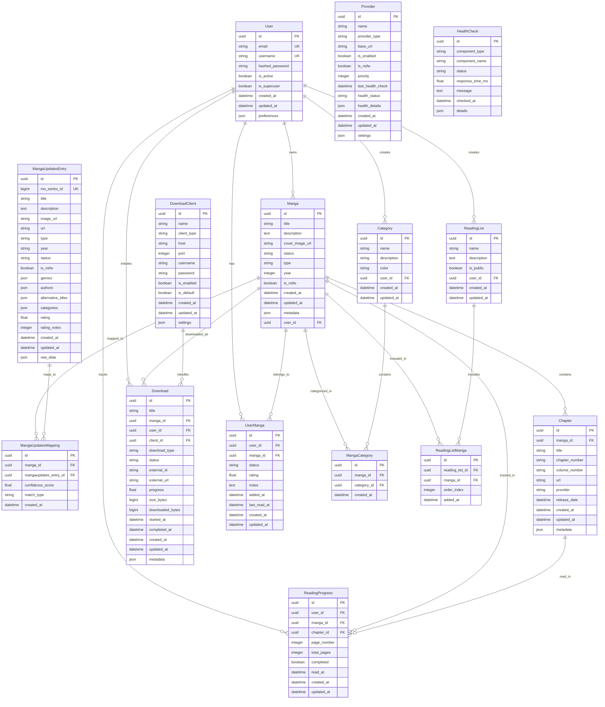

# Kuroibara Database Schema

This document provides a comprehensive overview of the Kuroibara database schema, including entity relationships, data flow, and design decisions.

## Database Overview

Kuroibara uses PostgreSQL as its primary database with the following design principles:
- **Normalized structure** to reduce data redundancy
- **Foreign key constraints** to maintain data integrity
- **Indexing strategy** for optimal query performance
- **JSON fields** for flexible metadata storage

---

## Entity Relationship Diagram



---

## Key Design Decisions

### 1. UUID Primary Keys
- **Benefit**: Globally unique identifiers, better for distributed systems
- **Trade-off**: Slightly larger storage footprint than integers
- **Use Case**: Enables easy data migration and external API integration

### 2. JSON Metadata Fields
- **Benefit**: Flexible schema for provider-specific data
- **Trade-off**: Less queryable than normalized columns
- **Use Case**: Store raw API responses and dynamic metadata

### 3. Soft Relationships
- **Benefit**: Maintains data integrity while allowing flexibility
- **Implementation**: Foreign keys with cascade options
- **Use Case**: User deletion doesn't orphan manga data

### 4. Audit Timestamps
- **Fields**: `created_at`, `updated_at` on all entities
- **Benefit**: Track data lifecycle and debugging
- **Implementation**: Automatic updates via SQLAlchemy events

---

## Indexing Strategy

### Primary Indexes
```sql
-- Performance-critical indexes
CREATE INDEX idx_manga_user_id ON manga(user_id);
CREATE INDEX idx_manga_title_search ON manga USING gin(to_tsvector('english', title));
CREATE INDEX idx_chapter_manga_id ON chapter(manga_id);
CREATE INDEX idx_download_user_status ON download(user_id, status);
CREATE INDEX idx_mangaupdates_series_id ON mangaupdates_entry(mu_series_id);

-- Composite indexes for common queries
CREATE INDEX idx_user_manga_status ON user_manga(user_id, status);
CREATE INDEX idx_reading_progress_user_manga ON reading_progress(user_id, manga_id);
CREATE INDEX idx_health_check_component_time ON health_check(component_type, checked_at);
```

### Search Optimization
```sql
-- Full-text search indexes
CREATE INDEX idx_manga_fulltext ON manga USING gin(
    to_tsvector('english', title || ' ' || coalesce(description, ''))
);

CREATE INDEX idx_mangaupdates_fulltext ON mangaupdates_entry USING gin(
    to_tsvector('english', title || ' ' || coalesce(description, ''))
);
```

---

## Data Integrity Constraints

### Foreign Key Constraints
- **Cascading Deletes**: User deletion cascades to user-specific data
- **Restrict Deletes**: Manga with chapters cannot be deleted
- **Set Null**: Provider deletion sets provider_id to null in chapters

### Check Constraints
```sql
-- Ensure valid status values
ALTER TABLE manga ADD CONSTRAINT manga_status_check 
    CHECK (status IN ('ongoing', 'completed', 'hiatus', 'cancelled'));

-- Ensure valid download progress
ALTER TABLE download ADD CONSTRAINT download_progress_check 
    CHECK (progress >= 0 AND progress <= 100);

-- Ensure valid ratings
ALTER TABLE user_manga ADD CONSTRAINT user_manga_rating_check 
    CHECK (rating >= 0 AND rating <= 10);
```

---

## Performance Considerations

### Query Optimization
1. **Eager Loading**: Use JOIN queries for related data
2. **Pagination**: Implement cursor-based pagination for large datasets
3. **Caching**: Cache frequently accessed manga metadata
4. **Connection Pooling**: Reuse database connections efficiently

### Storage Optimization
1. **Image URLs**: Store URLs, not binary data
2. **JSON Compression**: Use JSONB for better performance
3. **Archival Strategy**: Move old health checks to separate tables
4. **Vacuum Strategy**: Regular maintenance for optimal performance
