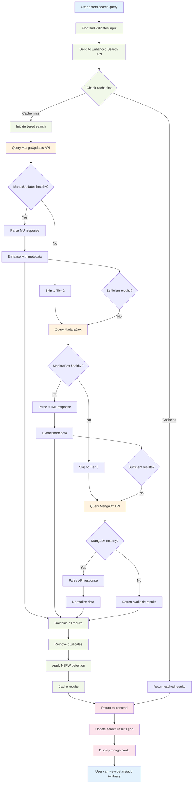
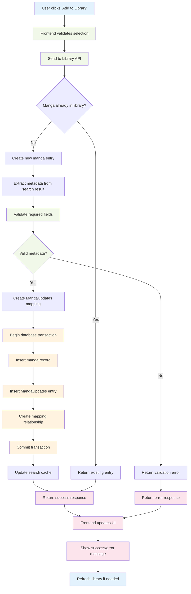
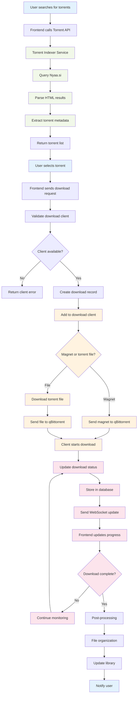
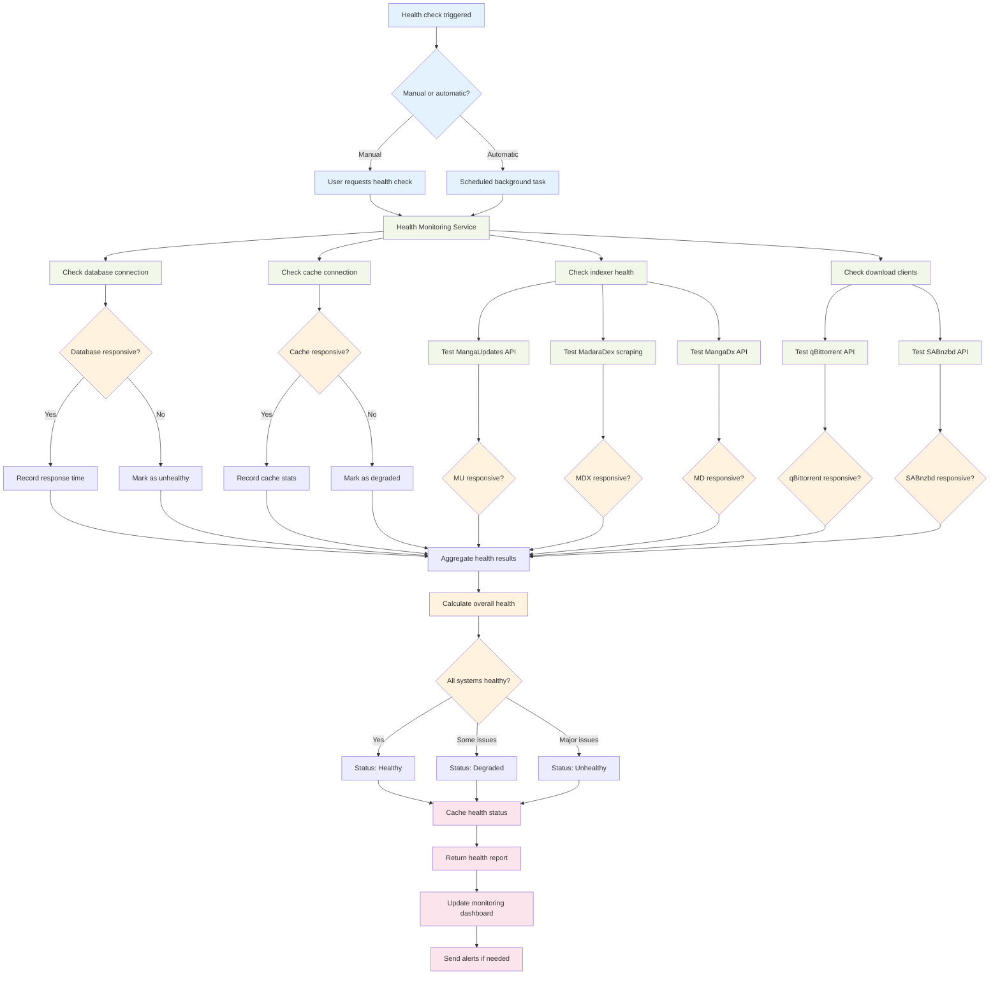

# Kuroibara Data Flow Diagrams

This document provides detailed data flow diagrams showing how information moves through the Kuroibara system for different user scenarios.

## Table of Contents

1. [Search Flow](#search-flow)
2. [Library Management Flow](#library-management-flow)
3. [Download Flow](#download-flow)
4. [Health Monitoring Flow](#health-monitoring-flow)

---

## Search Flow

### Enhanced Search Data Flow

---

## Library Management Flow

### Add to Library Data Flow

---

## Download Flow

### Torrent Download Data Flow

---

## Health Monitoring Flow

### System Health Check Data Flow

---

## Data Flow Patterns

### Common Patterns Used Throughout Kuroibara

1. **Request-Response Pattern**: Standard HTTP request/response cycle
2. **Event-Driven Pattern**: WebSocket updates for real-time data
3. **Cache-Aside Pattern**: Check cache first, populate on miss
4. **Circuit Breaker Pattern**: Fail fast when external services are down
5. **Retry Pattern**: Automatic retry with exponential backoff
6. **Bulkhead Pattern**: Isolate failures to prevent cascade effects

### Performance Optimizations

- **Lazy Loading**: Load data only when needed
- **Pagination**: Limit result sets for better performance
- **Debouncing**: Reduce API calls for rapid user input
- **Prefetching**: Load likely-needed data in advance
- **Connection Pooling**: Reuse database connections efficiently
